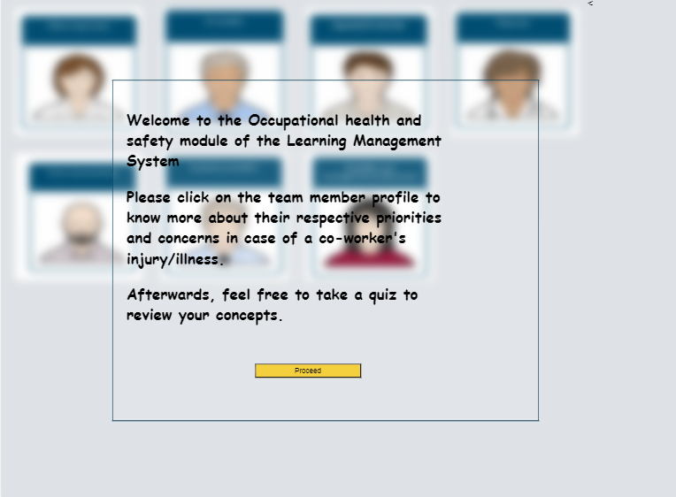
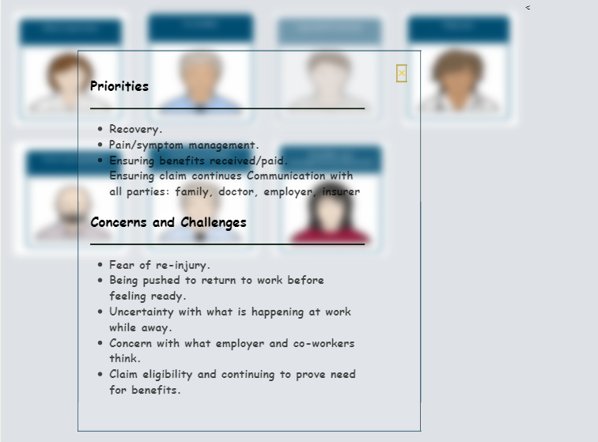
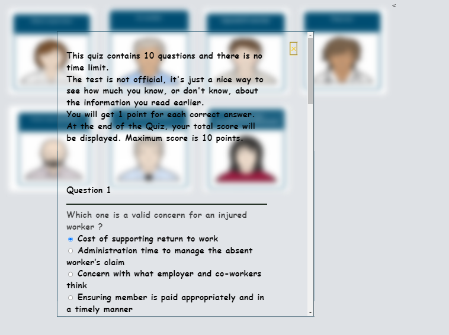

This web page serves as an module for a Learning Management System (LSM) that focuses on occupational health and safety. The goal of this module is about the priorities and concerns; work team members will have during a worker's injury/illness. 

This UX of this web page is adapted to provide a desirable experience on different screen resolutions to maximize audience engagement. 

<h1> Landing Page Preview </h1>

 Simply clicking on the team member profile would show their concerns and priotities

 Afterwards, users can take a quiz to review the educational material.

Please redirect any queries to [Sidd Chugh](mailto:sidd032@gmail.com)